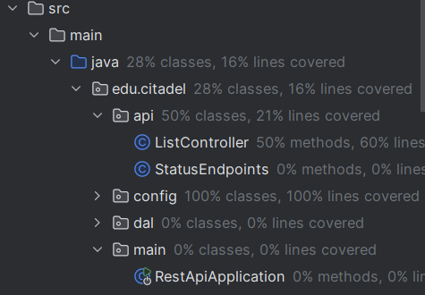
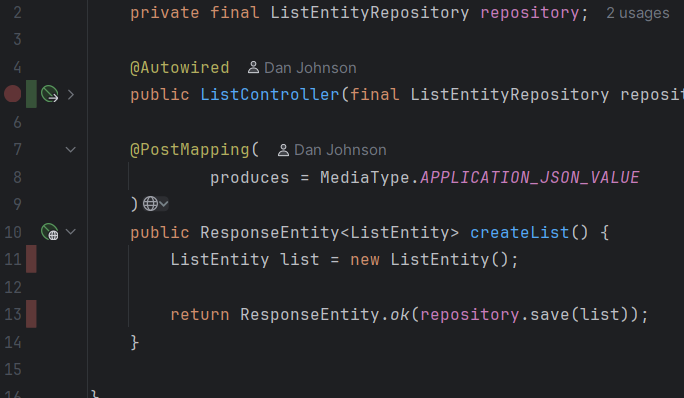
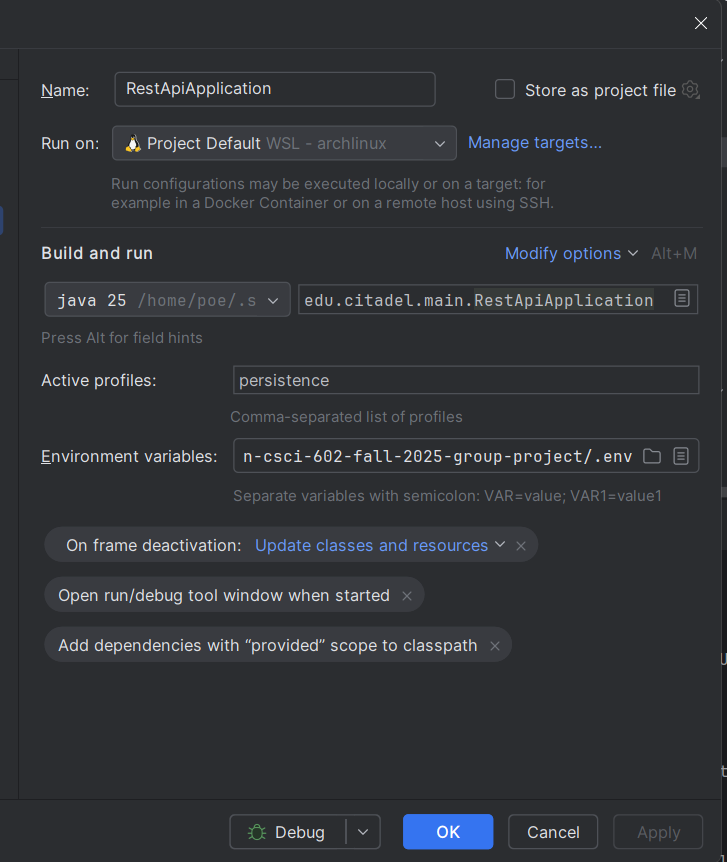

[//]: # ([![Open in Codespaces]&#40;https://classroom.github.com/assets/launch-codespace-2972f46106e565e64193e422d61a12cf1da4916b45550586e14ef0a7c637dd04.svg&#41;]&#40;https://classroom.github.com/open-in-codespaces?assignment_repo_id=20403271&#41;)
# Mutual Inclusion -- CSCI 602 -- Fall 2025 Group Project

This is the repository for the CSCI 602 Group Project that consists of the
following students:

+ Christian Soto
+ Dan Johnson
+ Erin McCall
+ Tuck Williamson

[](https://opensource.org/licenses/MIT)
[](http://makeapullrequest.com)

## Environment Setup (Students)

1. Install Java JDK 17+. JDK located [here](https://docs.aws.amazon.com/corretto/latest/corretto-17-ug/downloads-list.html). If you have a Mac you can use `brew`.
    
    ```bash
    brew install --cask corretto@17
    ```
    
    If you're on Windows, download the `.msi` installer from [here](https://docs.aws.amazon.com/corretto/latest/corretto-17-ug/downloads-list.html) and run.

4. Clone down the repository from Github
    
    ```bash
    git clone git@git.github.com:CitadelCS/csci-602-fall-2021-{yourUsername}.git
    ```

5. Build the project

    > Disclaimer: If running on a Windows machine replace `./mvnw` with `.\mvnw`
    
    ```bash
    ./mvnw clean install
    ```
    
    You should see a success if everything is set up correctly.

6. Run the API

    ```bash
    ./mvnw spring-boot:run
    ```


7. **Success!**
    
    Access the API by visiting [http://localhost:5001/swagger-ui/index.html](http://localhost:5001/swagger-ui/index.html). From there you can hit the endpoints directly.
    
    Or you can click the links when the banner pops up as the project starts (these will
    have the correct port - in case the above link gets stale).

### API Endpoints

The following endpoints are available once the API is running:

| Endpoint         | Method | Description | Example Response |
|------------------|---------|--------------|------------------|
| `/server/status` | GET | Returns a simple confirmation that the API is reachable. | `Hello World` |
| `/server/health`        | GET | Reports basic application health. | `{ "status": "ok" }` |
| `/server/info`          | GET | Provides application metadata including name, version, and description. | `{ "name": "Mutual Inclusion", "version": "1.0.0", "description": "CSCI 602 Group Project" }` |

You can test them in your browser by entering the desired endpoint after the local host url:
http://localhost:5001[endpoint].
ex: http://localhost:5001/server/status


## Resources

### Spring Boot

For further references with Spring Boot:

- [Spring Initializr](https://start.spring.io/)
- [Getting Started](https://spring.io/guides/gs/spring-boot/)

### Maven

For further references with Maven's dependency management framework:

- [Spring and Maven](https://spring.io/guides/gs/spring-boot/)
- [Official Apache Maven documentation](https://maven.apache.org/guides/index.html)
- [Apache Maven Getting Started](https://maven.apache.org/guides/getting-started/)


### Unit Testing and Coverage With JaCoCo

There are two main executions for JaCoCo in the `pom.xml` file:

1. `prepare-agent` - This execution generates the `${project.build.directory}/jacoco.exec` file when tests are run.
2. `report` - This execution generates the code coverage report in HTML format located at `${project.build.directory}/site/jacoco/index.html`.

#### Viewing Code Coverage Using Intellij IDEA

1. Run the tests in your project (note: as the testing phase precedes the packaging phase, this will still be generated using `mvn clean package` or `mvn clean install`).
2.  Navigate to `Run` -> `Manage Coverage Reports...`


3.  Click on `+` to add a new coverage report


4. Select the `jacoco.exec` file located at `$PROJECT_ROOT/target/jacoco.exec`
5. Click "Show Selected"
6.  You should be able to see the coverage within the project explorer



7.  Within the editor, you can see the coverage for each line of code (green = covered, red = not covered, yellow = partially covered)




### Persistence Using PostgreSQL Credentials

- **Requirements**: You must have your credentials from the beginning of the semester to access the PostgreSQL database.
- **Configuration**: Create a `.env` file in the root directory of the project with the following content:
```env
DB_URL="jdbc:your:database:url"
DB_USERNAME="your_database_username"
DB_PASSWORD="your_database_password"
```

#### Running with Persistence Profile
Once the `.env` file is created, you can run the application using the `persistence` profile to enable database connectivity:
To run the application from the command line:
```bash
export $(grep -v -e "^#\s*" .env | sed "s/#.*$//" | xargs)
mvn spring-boot:run -Dspring-boot.run.profiles=persistence
```

Alternatively, you can set the active profile in your IDE's run configuration to `persistence` and ensure the environment variables from the `.env` file are loaded.


### Containerization

Containerization is a method of packaging an application into a contained package
that can be distributed amongst diverse environments, including virtual machines,
servers, etc.

Containerization allows us to easily version and distribute our application, and is 
well-suited for CI/CD pipelines.

#### Containerization using jib maven plugin

##### Prerequisites

* `docker`
  - Logged into `docker.io` to pull base images
  - Logged into `ghcr.io` (AKA GitHub Container Registry) to push images

##### Containerizing to local Docker Daemon

This is attached to the build process, but is set to skip automatically 
by default.  To run this as part of the build and create an image on your 
local docker daemon, run the following command:

```bash
mvn -B package -Djib.docker-build.skip=false
```


#### CI/CD with GitHub Actions

The workflow file now pushes the built image to the `Mut-Ink` organization's package
section in `ghcr.io`.  If logged in to `ghcr.io`, the image can be pulled using:

```bash
docker pull ghcr.io/mut-ink/mut-ink:latest
```
